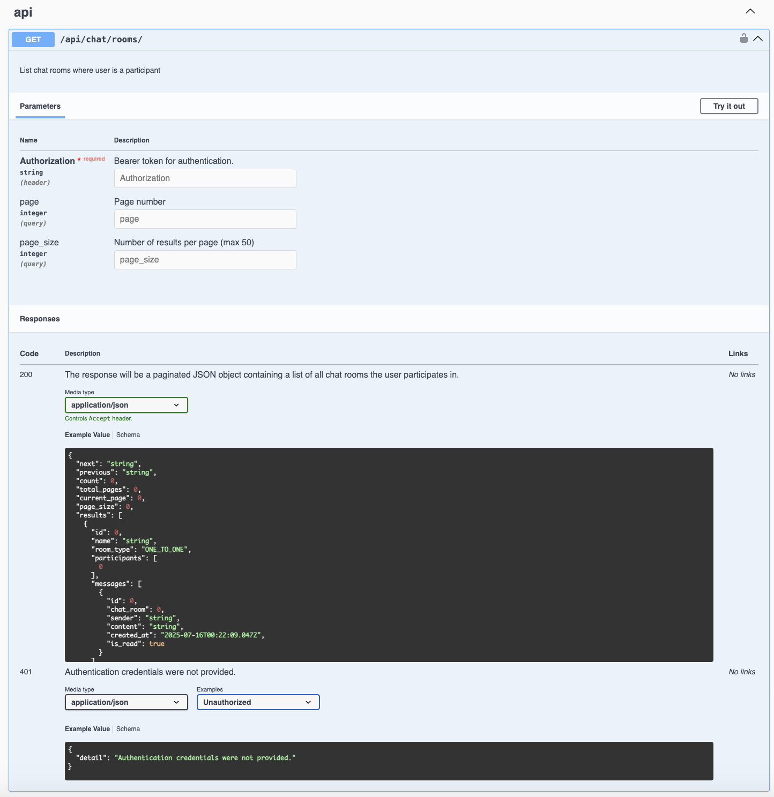
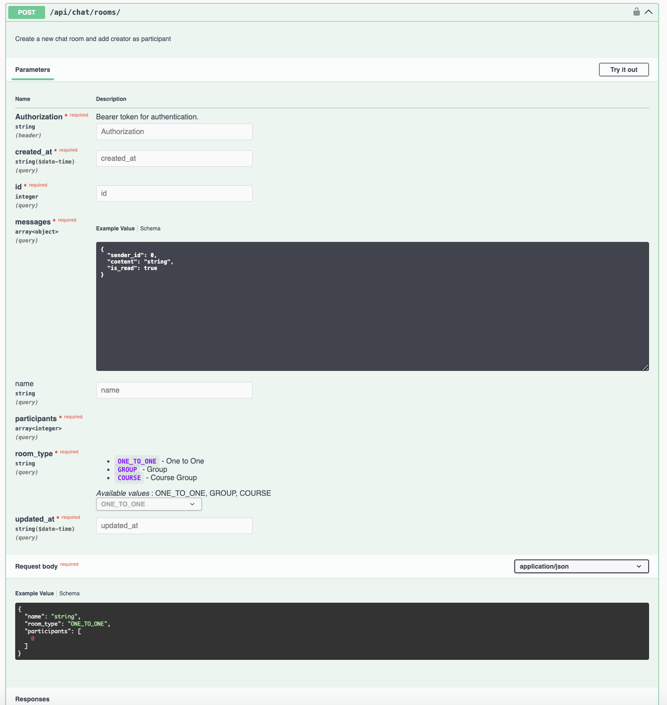

## Proposal to introduce drf_spectacular as a replacement for handwritten schemas

### Motivation

#### Problem Statement

The current implementation of API schemas in EduLite relies on handwritten schemas, which can be error-prone and 
difficult to maintain over time. The proposal is to introduce `drf_spectacular`, a library that automatically generates 
OpenAPI 3.0 schemas for Django REST Framework (DRF) applications.

#### Proposed Solution

Introduce drf_spectacular as a way to automatically generate and maintain generally accurate OpenAPI 3.0 documentation 
for the DRF APIs.

### Objectives

* Improve developer experience with self-explanatory, discoverable API endpoints.
* Enable automatic client generation and third-party integration via OpenAPI schema.
* Improve onboarding and contributor support by reducing the learning curve.
* Ensure documentation stays in sync with code and is easy to maintain.

### Overview

DRF Spectacular is a library that provides:

> Sane and flexible OpenAPI (3.0.3 & 3.1) schema generation for Django REST framework.

#### Alternatives Considered

* [drf-yasg](https://github.com/axnsan12/drf-yasg)
* Manual Documentation

### Implementation Plan

1. **Install drf_spectacular**:
   Add `drf_spectacular` to the project's requirements and install it.

   ```bash
   pip install drf-spectacular
   ```
   
2. **Update Django Settings**:

then add drf-spectacular to installed apps in settings.py

    ```python
    INSTALLED_APPS = [
        # ALL YOUR APPS
        'drf_spectacular',
    ]
    ``` 

register our spectacular AutoSchema with DRF

    ```python
    REST_FRAMEWORK = {
         'DEFAULT_SCHEMA_CLASS': 'drf_spectacular.openapi.AutoSchema',
    }
    ```

set drf-spectacular settings in settings.py

    ```python
    SPECTACULAR_SETTINGS = {
        'TITLE': 'EduLite API',
        'DESCRIPTION': 'API documentation for EduLite',
        'SERVE_INCLUDE_SCHEMA': False,
        'SECURITY': [
            {
                'bearerAuth': {
                    'type': 'http',
                    'scheme': 'bearer',
                    'bearerFormat': 'JWT',
                }
            }
        ],
        # configure sidecar for serving static files
        'SWAGGER_UI_DIST': 'SIDECAR',
        'SWAGGER_UI_FAVICON_HREF': 'SIDECAR',
        'REDOC_DIST': 'SIDECAR',
    }
    ```

**__note:__** VERSION _could_ be included in the settings, but since we don't have an automated versioning system in place, it is not included here.

**__note:__** SWAGGER and REDOC are two different ui tools for displaying the OpenAPI schema. We can choose to use one or both based on our preference.

3. **Annotate Views**:
   Use `@extend_schema` decorators to annotate views with additional metadata, such as descriptions, responses, and parameters.

   ```python
   @extend_schema(
    parameters=[
        OpenApiParameter(
            name='Authorization',
            type=OpenApiTypes.STR,
            location=OpenApiParameter.HEADER,
            required=True,
            description='Bearer token for authentication.',
        ),
    ],
   )
   class ChatRoomListCreateView(ChatAppBaseAPIView):
   """
   API view to list chat rooms the authenticated user is part of or create a new chat room.

    GET:
    - Returns a paginated list of chat rooms where the authenticated user is a participant.

    POST:
    - Creates a new chat room and automatically adds the creator as a participant.

    Responses:
    - 200: Successfully retrieved the list of chat rooms.
    - 201: Successfully created a new chat room.
    - 400: Invalid data provided for creating a chat room.
    """
    serializer_class = ChatRoomSerializer
    permission_classes = [IsAuthenticated, IsParticipant]
    pagination_class = ChatRoomPagination

    @extend_schema(
        # define parameters as we've overridden the base class
        parameters=[
            OpenApiParameter(
                name='page',
                type=OpenApiTypes.INT,
                location=OpenApiParameter.QUERY,
                description='Page number'
            ),
            OpenApiParameter(
                name='page_size',
                type=OpenApiTypes.INT,
                location=OpenApiParameter.QUERY,
                description='Number of results per page (max 50)'
            ),
        ],
        responses={
            200: OpenApiResponse(
                description="The response will be a paginated JSON object containing a list of all chat rooms the user participates in.",
                response=inline_serializer(
                    name='ChatRoomPaginatedResponse',
                    fields={
                        'next': serializers.URLField(allow_null=True),
                        'previous': serializers.URLField(allow_null=True),
                        'count': serializers.IntegerField(),
                        'total_pages': serializers.IntegerField(),
                        'current_page': serializers.IntegerField(),
                        'page_size': serializers.IntegerField(),
                        'results': ChatRoomSerializer(many=True),
                    }
                )
            ),
            401: OpenApiResponse(
                description="Authentication credentials were not provided.",
                response=inline_serializer(
                    name='UnauthorizedError',
                    fields={
                        'detail': serializers.CharField()
                    },
                ),
                examples=[
                    OpenApiExample(
                        'Unauthorized',
                        value={
                            "detail": "Authentication credentials were not provided."
                        }
                    )
                ]
            ),
        },
    )
    def get(self, request, *args, **kwargs):
        """List chat rooms where user is a participant"""
        # Get queryset of chat rooms where user is a participant
        queryset = ChatRoom.objects.filter(participants=self.request.user)
    
        # Initialize paginator and paginate queryset
        paginator = self.pagination_class()
        paginated_queryset = paginator.paginate_queryset(queryset, request, view=self)
    
        # Serialize paginated data
        serializer = ChatRoomSerializer(
            paginated_queryset,
            many=True,
            context=self.get_serializer_context()
        )
    
        # Return paginated response
        return paginator.get_paginated_response(serializer.data)

    @extend_schema(
        parameters=[
            ChatRoomSerializer,
        ],
        responses={
            201: OpenApiResponse(
                description="The response will contain the details of the newly created chat room.",
                response=ChatRoomSerializer()
            ),
            400: OpenApiResponse(
                description="Invalid data provided for creating a chat room.",
                response=inline_serializer(
                    name='ChatRoomValidationError',
                    fields={
                        'participants': serializers.ListField(
                            child=serializers.CharField()
                        ),
                        'room_type': serializers.CharField(),
                    }
                ),
                examples=[
                    OpenApiExample(
                        'Invalid Participant',
                        value={
                            "detail": "Invalid pk \"X\" - object does not exist."
                        }
                    ),
                    OpenApiExample(
                        'Missing Room Type',
                        value={
                            "detail": "This field is required."
                        }
                    ),
                    OpenApiExample(
                        'Invalid Room Type',
                        value={
                            "detail": "\"X\" is not a valid choice."
                        }
                    )
                ]
            ),
            401: OpenApiResponse(
                description="Authentication credentials were not provided.",
                response=inline_serializer(
                    name='UnauthorizedError',
                    fields={
                        'detail': serializers.CharField()
                    },
                ),
                examples=[
                    OpenApiExample(
                        'Unauthorized',
                        value={
                            "detail": "Authentication credentials were not provided."
                        }
                    )
                ]
            ),
        },
    )
    def post(self, request, *args, **kwargs):
        """Create a new chat room and add creator as participant"""
        serializer = ChatRoomSerializer(data=request.data, context=self.get_serializer_context())
        if serializer.is_valid():
            chat_room = serializer.save()
            chat_room.participants.add(request.user)
            return Response(
                ChatRoomSerializer(chat_room, context=self.get_serializer_context()).data,
                status=status.HTTP_201_CREATED
            )
        return Response(serializer.errors, status=status.HTTP_400_BAD_REQUEST)
   ```

### Example Impact





### Recommendation

I recommend adopting `drf_spectacular` to enhance the API documentation process in EduLite. This will not only improve 
the quality and maintainability of the API documentation but also provide a better developer experience for both current 
and future contributors.

That said, `drf_spectacular` is not a silver bullet. It requires careful configuration and testing to ensure that the 
generated documentation is accurate and useful. It is important to follow best practices when annotating views and
serializers to ensure that the generated schema is comprehensive and self-explanatory.

### Reference Documentation

* [drf_spectacular Documentation](https://drf-spectacular.readthedocs.io/en/latest/readme.html)
* [drf_spectacular Installation](https://drf-spectacular.readthedocs.io/en/latest/readme.html#installation)
